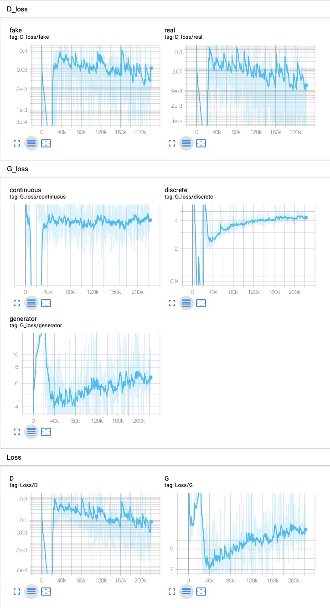
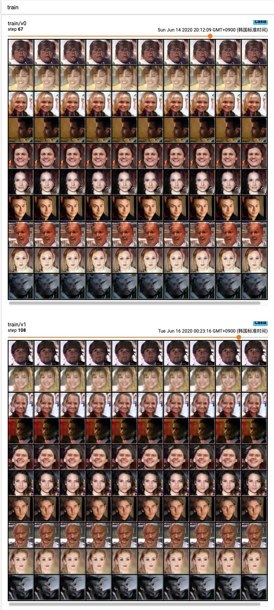
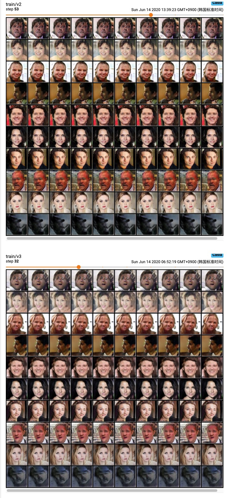

## Train InfoGAN on CASIA_webface dataset

### 1. Configuration

Refer to the [config](../config/casia_webface.yaml) file, and [model](../models/casia_model.py), the network architecture are shown below, we use 128 noise variables and 10 ten-dimensional categorical code, 5 continuous code, with total dimension 233 to generator. 

| **Discriminator $D$/ recognition network $Q$**  | Generator $Q$                                  |
| ----------------------------------------------- | ---------------------------------------------- |
| Input 65 x 65 Color image                       | Input $\in \Bbb{R}^{233}$                      |
| 4x4 conv. 64 **IRELU**, stride 2                | 1x1 upconv. 1024. **RELU**                     |
| 4x4 conv. 128 **IRELU**, stride 2, batchnorm    | 8x8 upconv. 256. **RELU**. batchnorm           |
| 4x4 conv. 256 **IRELU**, stride 2, batchnorm    | 4x4 upconv. 256. **RELU**. batchnorm           |
| 4x4 conv. 256 **IRELU**, batchnorm              | 4x4 upconv. 256. **RELU**. batchnorm           |
| 4x4 conv. 256 **IRELU**, batchnorm, padding 1   | 4x4 upconv. 128. **RELU**. batchnorm. stride 2 |
| $D$, 2x2 conv. 1, sigmoid, output               | 4x4 upconv. 64. **RELU**. batchnorm. stride 2  |
| $Q$, 2x2 conv. 128 **IRELU**, batchnorm, output | 4x4 upconv. 3 **tanh**                         |

### 2. Training Curve

### 3. Manipulating Latent codes on CASIA_webface
Unfortunately, the result seems not disentangled.

