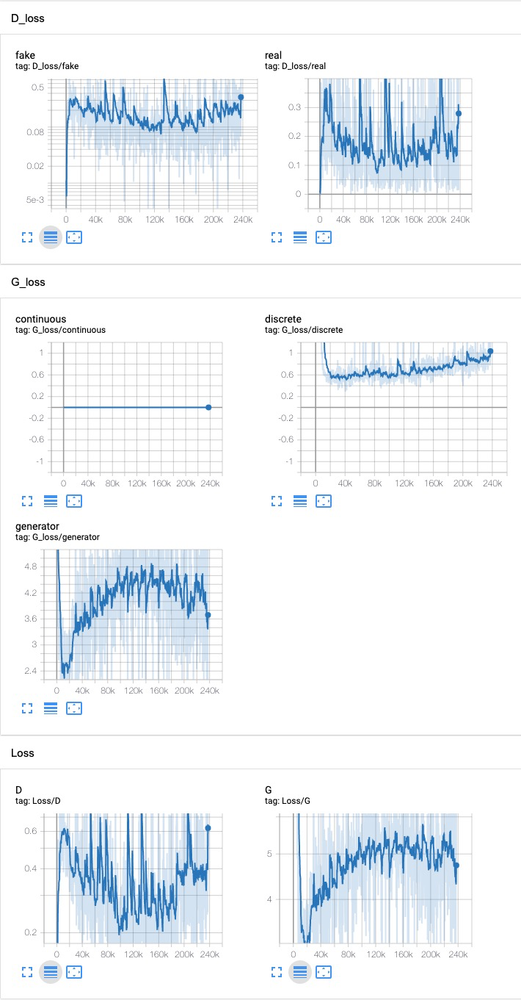
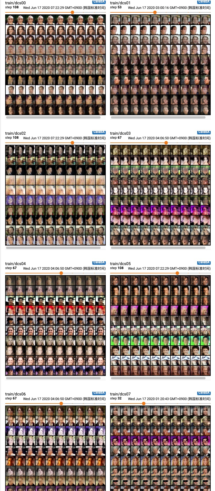

## Train InfoGAN on CelebA dataset

### 1. Configuration

Refer to the [config](../config/celeba.yaml) file, and [model](../models/celeba_model.py),  different than **C3.CelebA**, I use Convolution layer to replace FC in discriminator network, and ConvTransposed2d to replace FC in generator network. Beside，the raw size of celebA is 250x250, I resize to 32x32 to match the table in **C3.CelebA**

### 2. Training Curve

### 3. Manipulating Latent codes on CelebA
Unfortunately, I try to change the categorical code seems like change continuous code on **MNIST**, but the network is not well convergence, and I cannot see obvious change which modify the categorical code.

##### 3.3.3 Training change

