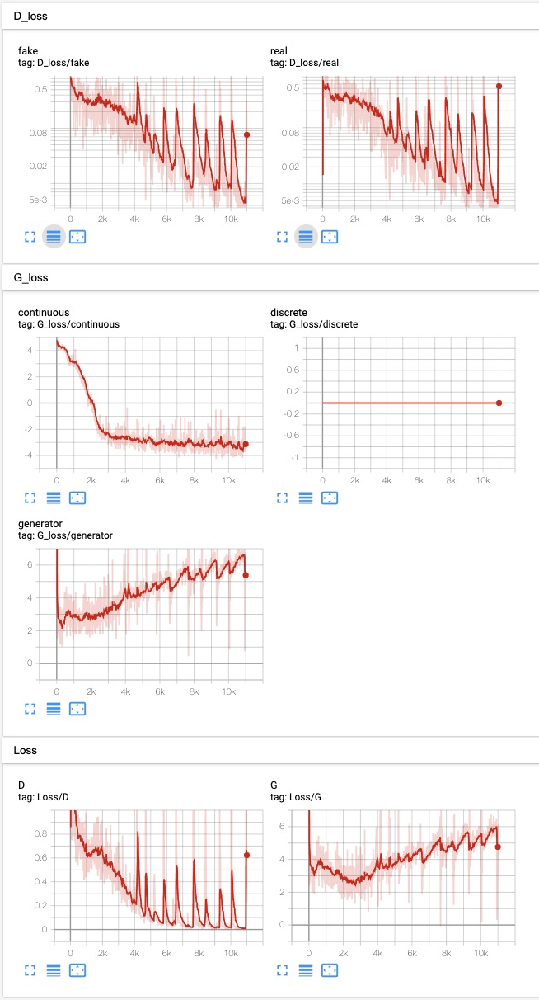
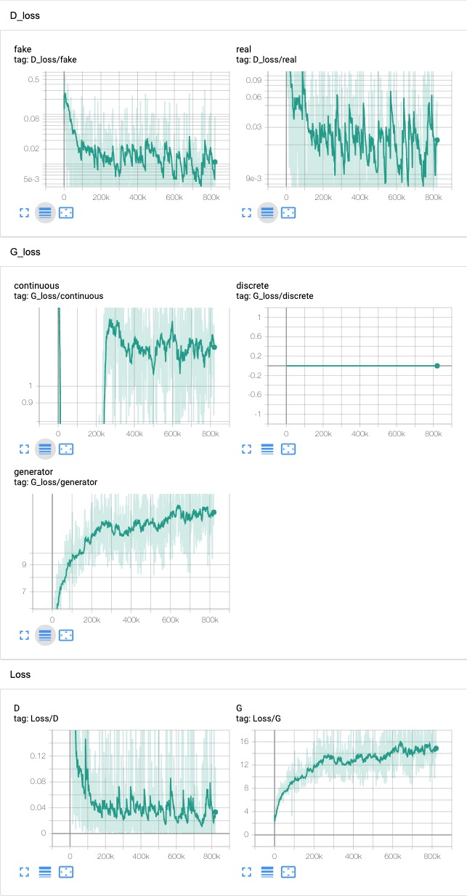
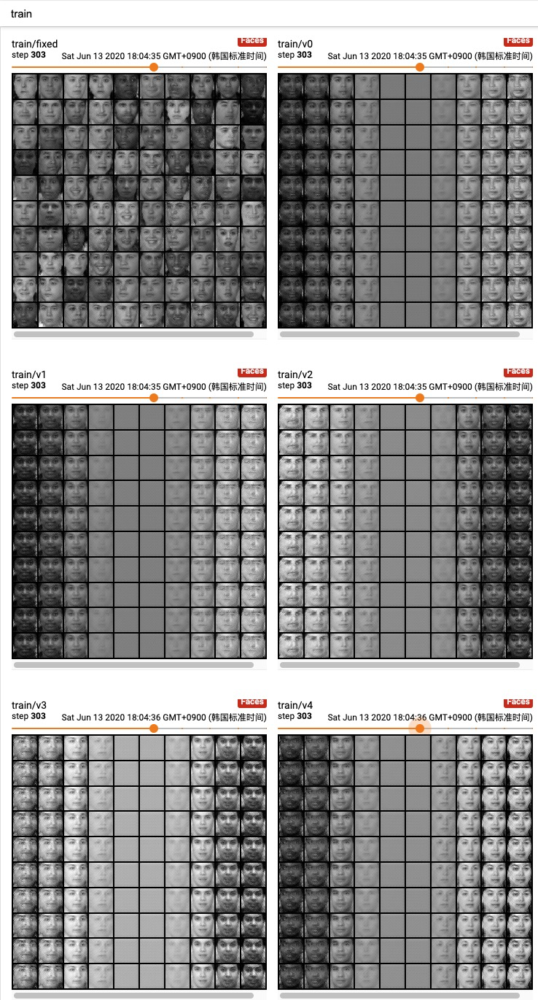
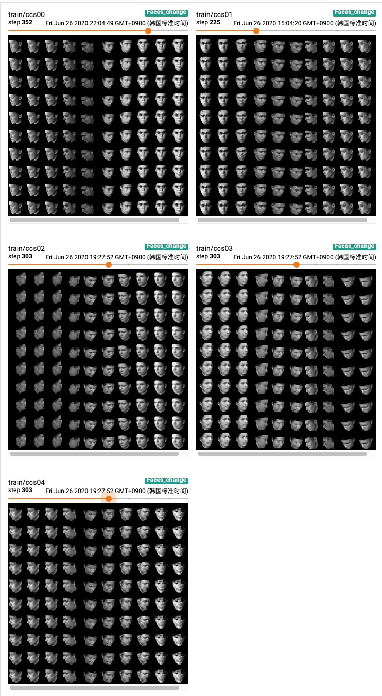

## Train InfoGAN on FACES dataset

### 1. Configuration

Refer to the [config](../config/faces.yaml) file, and [model](../models/faces_model.py),  different than **C4.Faces**, I use Convolution layer to replace FC in discriminator network, and ConvTransposed2d to replace FC in generator network. I refer the paper *A 3d face model for pose and illumination invariant face recognition*, and find that there has two face dateset, I don’t know which is match, so I train both of them, and named dataset as **faces**, **feret**

### 2. Training Curve

#### 2.1 Feret

#### 2.2 Faces

### 3. Manipulating Latent codes on Faces

#### 3.1 Latent code on Feret

Because the faces has 5 continuous latent codes, so $v_{0…4}$ represented to continuous code $v_0, …, v_4$

#### 3.2 Latent code on Faces

$ccs00\sim 04$ represented to continuous code $ccs00, …, ccs04$,  $ccs01$ shows the pose, $ccs02$ draws the elevation, lighting can see in $ccs04$.

#### 3.3 Training change on feret & faces

##### 3.3.1 feret

<table align='center'>
<tr align='center'>
<th> ccs00 </th>
<th> ccs01 </th>
<th> ccs02 </th>
<th> ccs03 </th>
<th> ccs04 </th>
</tr>
<tr>
<td>
<td>
<td>
<td>
<td>
</tr>
</table>

##### 3.3.3 faces

<table align='center'>
<tr align='center'>
<th> ccs00 </th>
<th> ccs01 </th>
<th> ccs02 </th>
<th> ccs03 </th>
<th> ccs04 </th>
</tr>
<tr>
<td>
<td>
<td>
<td>
<td>
</tr>
</table>

