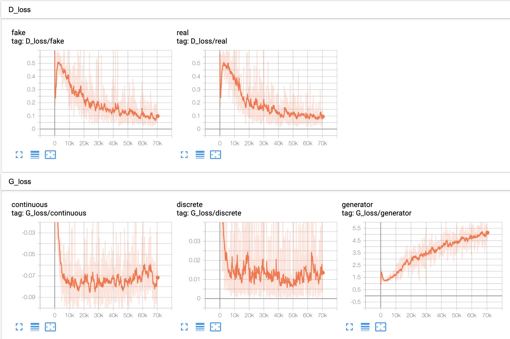
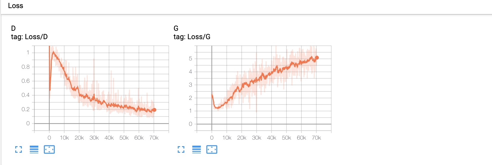
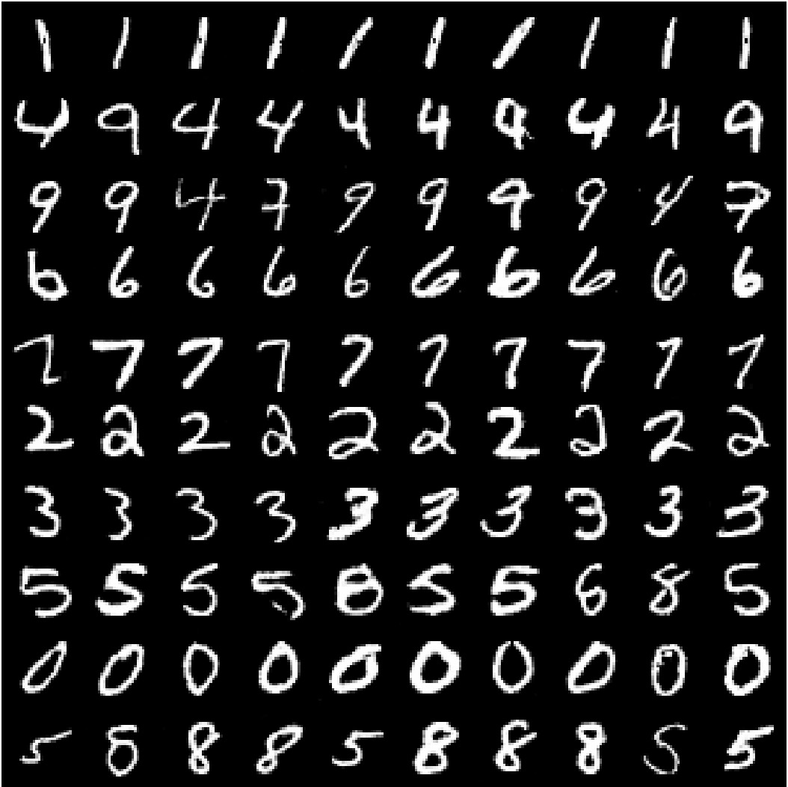
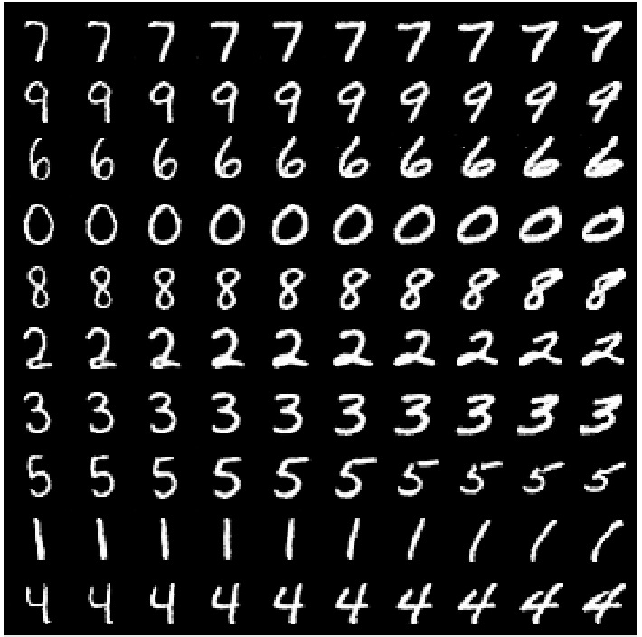
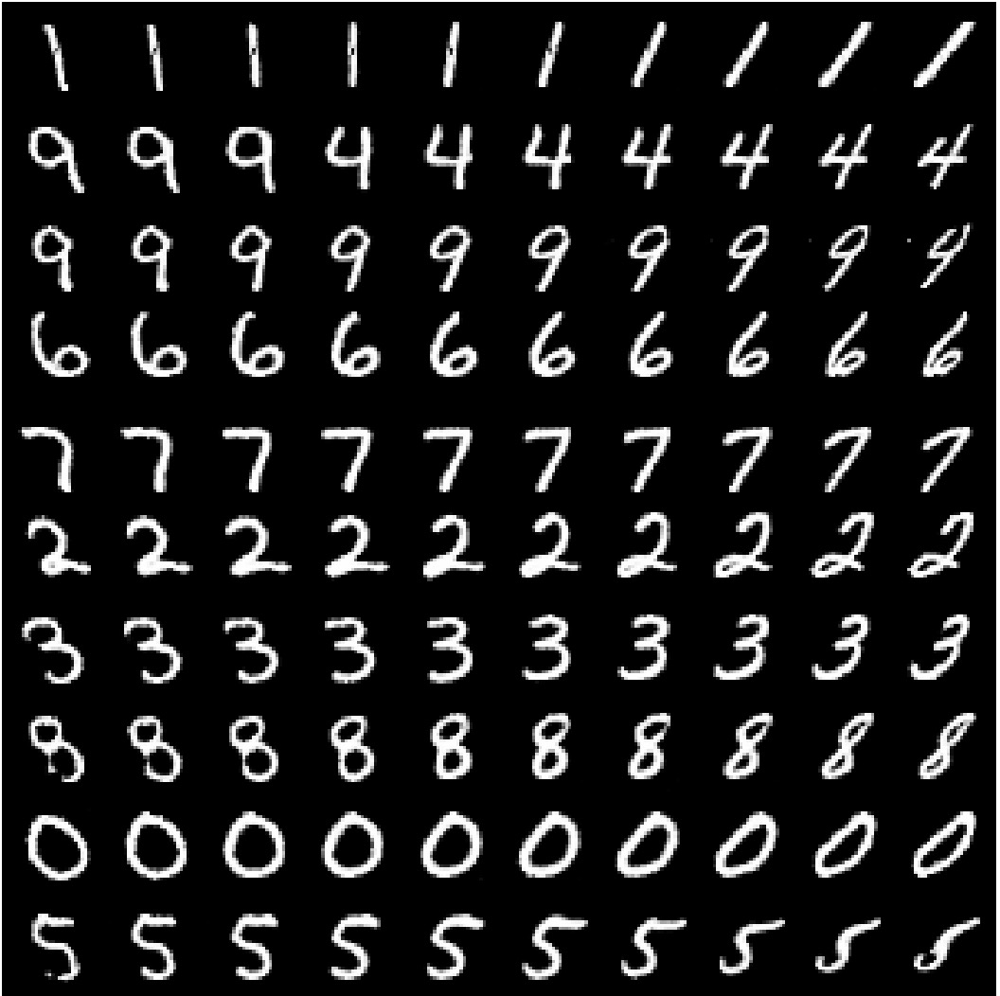
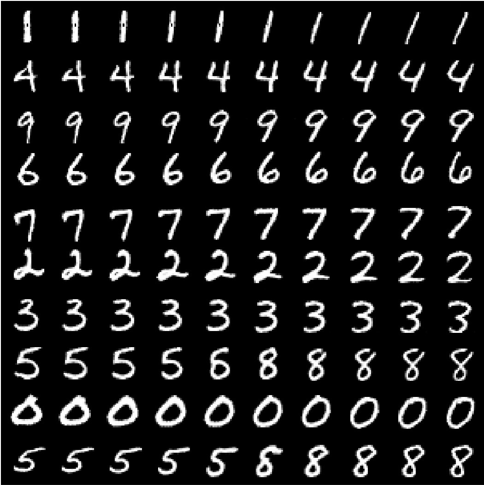

## Train InfoGAN on MNIST dataset

### 1. Configuration

Refer to the [config](../config/mnist.yaml) file, and [model](../models/mnist_model.py),  different than **C1.MNIST**, I use Convolution layer to replace FC in discriminator network, and ConvTransposed2d to replace FC in generator network.

### 2. Training Curve

### 3. Manipulating Latent codes on MNIST

<table align='center'>
<tr align='center'>
<th> Random Generator </th>
<th> Varing c1 on InfoGAN </th>
</tr>
<tr>
<td>
<td>
</tr>
<th> Varing c2 from -2 to 2 on InfoGAN </th>
<th> Varing c3 from -2 to 2 on InfoGAN </th>  
<tr>
<td>
<td>
</tr>
</table>

Training change

<table align='center'>
<tr align='center'>
<th> Random </th>
<th> c3 </th>
<th> c2 </th>
</tr>
<tr>
<td>
<td>
<td>
</tr>
</table>

